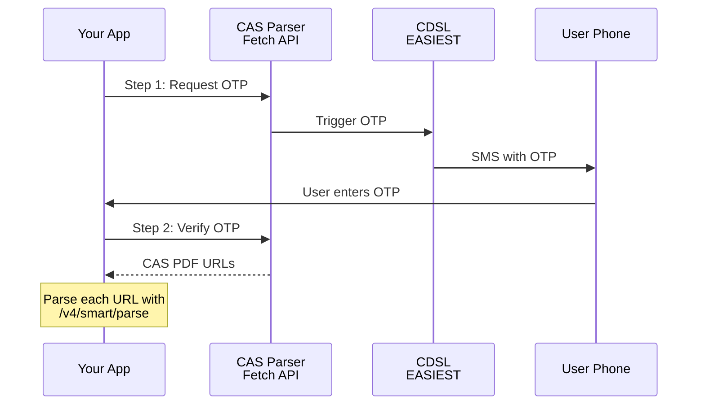

## Overview

CDSL OTP Fetch retrieves eCAS (electronic Consolidated Account Statement) PDF files directly from CDSL's EASIEST portal via OTP authentication.



**What you get:**
- Download URLs for up to 6 monthly eCAS PDFs
- **All holdings:** Demat + Non-Demat assets (stocks, bonds, mutual funds, AIFs, etc.)
- **Cross-depository:** Includes holdings from **both CDSL and NSDL** accounts
- No manual portal login required

<Warning>
  **Critical:** CDSL eCAS statements are **not limited to CDSL demat accounts**. They contain a consolidated view of all holdings across **both CDSL and NSDL** depositories, including both demat and non-demat assets. Similarly, NSDL eCAS also contains holdings from both depositories.
</Warning>

**What you need:**
- PAN number
- CDSL BO ID (16-digit Client ID)
- Date of birth

## Two-step flow

### Step 1: Request OTP

```python
import requests

response = requests.post(
    "https://api.casparser.in/v4/cdsl/fetch",
    headers={"x-api-key": "YOUR_API_KEY"},
    json={
        "pan": "ABCDE1234F",
        "bo_id": "1234567890123456",  # 16-digit CDSL BO ID
        "dob": "1990-01-15"  # YYYY-MM-DD format
    },
    timeout=50  # Captcha solving takes ~15-20 seconds
)

data = response.json()
session_id = data["session_id"]

# User receives OTP on registered mobile
```

<Warning>
  Step 1 takes **15-20 seconds** due to automated captcha solving. Set your timeout accordingly.
</Warning>

### Step 2: Verify OTP and get PDF URLs

```python
# User provides OTP from their phone
otp = "123456"

response = requests.post(
    f"https://api.casparser.in/v4/cdsl/fetch/{session_id}/verify",
    headers={"x-api-key": "YOUR_API_KEY"},
    json={
        "otp": otp,
        "num_periods": 6  # Number of monthly statements (default: 6)
    }
)

data = response.json()

# Response includes array of PDF download URLs
# {
#   "status": "success",
#   "msg": "Fetched 6 CAS files",
#   "files": [
#     {
#       "filename": "CDSL_CAS_1234567890123456_NOV2025.pdf",
#       "url": "https://cdn.casparser.in/cdsl-cas/session-id/CDSL_CAS_1234567890123456_NOV2025.pdf"
#     },
#     ...
#   ]
# }
```

## Full example

```python
import requests
import time

API_KEY = "YOUR_API_KEY"

def fetch_cdsl_cas_files(pan: str, bo_id: str, dob: str, otp_callback):
    """
    Fetch CDSL CAS PDF files via OTP.
    
    Args:
        pan: PAN number
        bo_id: 16-digit CDSL BO ID (Client ID)
        dob: Date of birth (YYYY-MM-DD)
        otp_callback: A function that prompts user for OTP and returns it
    
    Returns:
        List of PDF download URLs
    """
    
    # Step 1: Request OTP
    response = requests.post(
        "https://api.casparser.in/v4/cdsl/fetch",
        headers={"x-api-key": API_KEY},
        json={"pan": pan, "bo_id": bo_id, "dob": dob},
        timeout=50
    )
    
    data = response.json()
    if data.get("status") != "success":
        raise Exception(f"Failed to request OTP: {data.get('msg')}")
    
    session_id = data["session_id"]
    
    # User receives OTP on their registered mobile
    otp = otp_callback()  # Your UI prompts user for OTP
    
    # Step 2: Verify OTP and get PDF URLs
    response = requests.post(
        f"https://api.casparser.in/v4/cdsl/fetch/{session_id}/verify",
        headers={"x-api-key": API_KEY},
        json={"otp": otp, "num_periods": 6}
    )
    
    result = response.json()
    
    # Now parse each PDF file
    parsed_files = []
    for file in result.get("files", []):
        parse_response = requests.post(
            "https://api.casparser.in/v4/smart/parse",
            headers={"x-api-key": API_KEY},
            json={"pdf_url": file["url"], "password": pan}
        )
        parsed_files.append(parse_response.json())
    
    return parsed_files

# Usage
def prompt_otp():
    return input("Enter OTP received on your phone: ")

cas_files = fetch_cdsl_cas_files(
    pan="ABCDE1234F",
    bo_id="1234567890123456",
    dob="1990-01-15",
    otp_callback=prompt_otp
)

# Process each CAS file
for cas_data in cas_files:
    print(f"Total Value: ₹{cas_data['summary']['total_value']:,.2f}")
```

## Response format

```json
{
  "status": "success",
  "msg": "Fetched 6 CAS files",
  "files": [
    {
      "filename": "CDSL_CAS_1234567890123456_NOV2025.pdf",
      "url": "https://cdn.casparser.in/cdsl-cas/session-id/CDSL_CAS_1234567890123456_NOV2025.pdf"
    },
    {
      "filename": "CDSL_CAS_1234567890123456_OCT2025.pdf",
      "url": "https://cdn.casparser.in/cdsl-cas/session-id/CDSL_CAS_1234567890123456_OCT2025.pdf"
    }
  ]
}
```

<Note>
  The response contains **download URLs only**. To get parsed data, pass each URL to `/v4/smart/parse` with `pdf_url` parameter.
</Note>

## Credit usage

| Step | Credits |
|------|---------|
| Request OTP (Step 1) | 0 |
| Verify OTP (Step 2) | 0.5 |

<Note>
  You're only charged when Step 2 succeeds. Failed OTP attempts are not charged.
</Note>

## Error handling

| Error | Cause | Solution |
|-------|-------|----------|
| `Invalid PAN format` | PAN doesn't match pattern | Validate PAN: `[A-Z]{5}[0-9]{4}[A-Z]` |
| `No CDSL account found` | PAN not registered with CDSL | User doesn't have CDSL BO ID (may only use NSDL) |
| `OTP expired` | OTP older than 5 minutes | Request new OTP (repeat Step 1) |
| `Invalid OTP` | Wrong OTP entered | Ask user to re-enter |

## Using with Portfolio Connect SDK

```jsx
<PortfolioConnect
  accessToken="at_xxx"
  modes={["upload", "cdsl_fetch"]}  // Enable CDSL OTP fetch
  onSuccess={(data) => console.log(data)}
/>
```

## Next steps

<CardGroup cols={2}>
  <Card title="CAS Generator" icon="rotate" href="/guides/cas-generator">
    Generate CAS via email
  </Card>
  <Card title="Portfolio Connect SDK" icon="puzzle-piece" href="/sdk/portfolio-connect">
    Frontend widget with CDSL fetch
  </Card>
</CardGroup>
