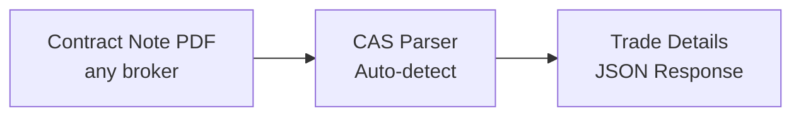

## Overview

Contract notes are daily trade confirmations from brokers. CAS Parser extracts structured trade data from these PDFs.



## Supported Brokers

| Broker | Auto-detected | Password |
|--------|---------------|----------|
| **Zerodha** | ✅ | PAN number |
| **Groww** | ✅ | PAN number |
| **Upstox** | ✅ | PAN number |
| **ICICI Direct** | ✅ | PAN number |

<Tip>
  The API auto-detects the broker — no need to specify which broker issued the contract note.
</Tip>

## Parse a contract note

<CodeGroup>
```python Python
import requests

response = requests.post(
    "https://api.casparser.in/v4/contract_note/parse",
    headers={"x-api-key": "YOUR_API_KEY"},
    files={"file": open("contract_note.pdf", "rb")},
    data={"password": "ABCDE1234F"}
)

data = response.json()
for trade in data.get("trades", []):
    print(f"{trade['symbol']}: {trade['quantity']} @ ₹{trade['price']}")
```

```javascript Node.js
const form = new FormData();
form.append('file', fs.createReadStream('contract_note.pdf'));
form.append('password', 'ABCDE1234F');

const response = await fetch('https://api.casparser.in/v4/contract_note/parse', {
  method: 'POST',
  headers: { 'x-api-key': 'YOUR_API_KEY' },
  body: form
});

const data = await response.json();
```

```bash cURL
curl -X POST https://api.casparser.in/v4/contract_note/parse \
  -H "x-api-key: YOUR_API_KEY" \
  -F "file=@contract_note.pdf" \
  -F "password=ABCDE1234F"
```
</CodeGroup>

## Response format

```json
{
  "status": "success",
  "broker": "zerodha",
  "trade_date": "2024-01-15",
  "client": {
    "name": "John Doe",
    "client_id": "AB1234",
    "pan": "ABCDE1234F"
  },
  "trades": [
    {
      "symbol": "RELIANCE",
      "isin": "INE002A01018",
      "exchange": "NSE",
      "segment": "EQ",
      "trade_type": "BUY",
      "quantity": 10,
      "price": 2450.50,
      "trade_value": 24505.00,
      "brokerage": 12.25,
      "stt": 24.51,
      "other_charges": 5.67,
      "net_value": 24547.43
    }
  ],
  "summary": {
    "total_buy_value": 24505.00,
    "total_sell_value": 0,
    "total_charges": 42.43,
    "net_obligation": 24547.43
  }
}
```

## Trade fields

| Field | Description |
|-------|-------------|
| `symbol` | Trading symbol (e.g., RELIANCE) |
| `isin` | ISIN code |
| `exchange` | NSE, BSE |
| `segment` | EQ (equity), FO (F&O), etc. |
| `trade_type` | BUY or SELL |
| `quantity` | Number of shares |
| `price` | Per-share price |
| `trade_value` | quantity × price |
| `brokerage` | Broker fee |
| `stt` | Securities Transaction Tax |
| `other_charges` | Exchange fees, GST, etc. |
| `net_value` | Final settlement amount |

## Credit usage

| Operation | Credits |
|-----------|---------|
| Parse contract note | 0.5 |

<Note>
  Contract notes cost **half a credit** compared to CAS parsing (1 credit).
</Note>

## Use cases

- **Portfolio tracking** — Automatically import trades into your app
- **Tax calculation** — Extract capital gains data for ITR filing
- **Trade analytics** — Analyze trading patterns and costs
- **Reconciliation** — Match broker records with demat statements

## Next steps

<CardGroup cols={2}>
  <Card title="Parsing CAS" icon="file-pdf" href="/guides/parsing">
    Parse portfolio statements
  </Card>
  <Card title="API Reference" icon="book" href="/api-reference">
    View all endpoints
  </Card>
</CardGroup>
