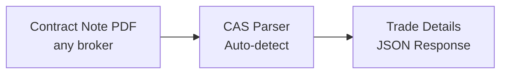

## Overview

Contract notes are daily trade confirmations from brokers. CAS Parser extracts structured trade data from these PDFs.



## Supported Brokers

| Broker | Auto-detected | Password |
|--------|---------------|----------|
| **Zerodha** | ✅ | PAN number |
| **Groww** | ✅ | PAN number |
| **Upstox** | ✅ | PAN number |
| **ICICI Direct** | ✅ | PAN number |

<Tip>
  The API auto-detects the broker — no need to specify which broker issued the contract note.
</Tip>

## Parse a contract note

<CodeGroup>
```python Python
import requests

response = requests.post(
    "https://api.casparser.in/v4/contract_note/parse",
    headers={"x-api-key": "YOUR_API_KEY"},
    files={"pdf_file": open("contract_note.pdf", "rb")},
    data={"password": "ABCDE1234F"}
)

result = response.json()
if result["status"] == "success":
    data = result["data"]
    for txn in data["equity_transactions"]:
        print(f"{txn['security_symbol']}: {txn['buy_quantity']} @ ₹{txn['buy_wap']}")
```

```javascript Node.js
const form = new FormData();
form.append('pdf_file', fs.createReadStream('contract_note.pdf'));
form.append('password', 'ABCDE1234F');

const response = await fetch('https://api.casparser.in/v4/contract_note/parse', {
  method: 'POST',
  headers: { 'x-api-key': 'YOUR_API_KEY' },
  body: form
});

const result = await response.json();
const data = result.data;
```

```bash cURL
curl -X POST https://api.casparser.in/v4/contract_note/parse \
  -H "x-api-key: YOUR_API_KEY" \
  -F "pdf_file=@contract_note.pdf" \
  -F "password=ABCDE1234F"
```
</CodeGroup>

## Response format

```json
{
  "status": "success",
  "msg": "success",
  "data": {
    "contract_note_info": {
      "contract_note_number": "CNT-25/26-73436720",
      "trade_date": "2025-08-05",
      "settlement_number": "2025149",
      "settlement_date": "2025-08-06"
    },
    "broker_info": {
      "broker_type": "zerodha",
      "name": "Zerodha Broking Limited",
      "sebi_registration": "INZ000031633"
    },
    "client_info": {
      "name": "JOHN DOE",
      "pan": "ABCDE1234F",
      "ucc": "AB1234",
      "place_of_supply": "DELHI",
      "gst_state_code": "7"
    },
    "equity_transactions": [
      {
        "isin": "INE002A01018",
        "security_name": "RELIANCE",
        "security_symbol": "RELIANCE",
        "buy_quantity": 10,
        "buy_wap": 2450.50,
        "buy_total_value": 24505.00,
        "sell_quantity": 0,
        "sell_wap": 0,
        "sell_total_value": 0,
        "net_obligation": 24547.43
      }
    ],
    "derivatives_transactions": [],
    "detailed_trades": [
      {
        "order_number": "1000000042939390",
        "order_time": "13:13:13",
        "trade_number": "4006567",
        "trade_time": "13:13:13",
        "security_description": "RELIANCE-EQ/INE002A01018",
        "buy_sell": "B",
        "exchange": "NSE",
        "quantity": 10,
        "brokerage": 12.25,
        "net_rate_per_unit": 2450.50,
        "closing_rate_per_unit": 2450.50,
        "net_total": 24547.43
      }
    ],
    "charges_summary": {
      "pay_in_pay_out_obligation": 24505.00,
      "taxable_value_brokerage": 12.25,
      "exchange_transaction_charges": 5.00,
      "cgst": 1.10,
      "sgst": 1.10,
      "igst": 0,
      "securities_transaction_tax": 24.51,
      "sebi_turnover_fees": 0.25,
      "stamp_duty": 2.45,
      "net_amount_receivable_payable": 24547.43
    }
  }
}
```

## Response Fields

### Contract Note Info
| Field | Description |
|-------|-------------|
| `contract_note_number` | Contract note reference number |
| `trade_date` | Date when trades were executed |
| `settlement_number` | Settlement reference |
| `settlement_date` | Settlement date |

### Equity Transactions (Summary)
| Field | Description |
|-------|-------------|
| `isin` | ISIN code of the security |
| `security_name` | Name of the security |
| `security_symbol` | Trading symbol |
| `buy_quantity` | Total quantity purchased |
| `buy_wap` | Weighted Average Price for buys |
| `buy_total_value` | Total buy value |
| `sell_quantity` | Total quantity sold |
| `sell_wap` | Weighted Average Price for sells |
| `sell_total_value` | Total sell value |
| `net_obligation` | Net amount payable/receivable |

### Detailed Trades
| Field | Description |
|-------|-------------|
| `order_number` | Order reference number |
| `trade_number` | Trade reference number |
| `security_description` | Security with exchange and ISIN |
| `buy_sell` | B (Buy) or S (Sell) |
| `exchange` | NSE, BSE, etc. |
| `quantity` | Quantity traded |
| `brokerage` | Brokerage for this trade |
| `net_rate_per_unit` | Net rate per unit |
| `net_total` | Net total for this trade |

### Charges Summary
| Field | Description |
|-------|-------------|
| `pay_in_pay_out_obligation` | Net pay-in/pay-out |
| `taxable_value_brokerage` | Taxable brokerage amount |
| `securities_transaction_tax` | STT amount |
| `stamp_duty` | Stamp duty charges |
| `cgst` / `sgst` / `igst` | GST components |
| `net_amount_receivable_payable` | Final settlement amount |

## Credit usage

| Operation | Credits |
|-----------|---------|
| Parse contract note | 0.5 |

<Note>
  Contract notes cost **half a credit** compared to CAS parsing (1 credit).
</Note>

## Use cases

- **Portfolio tracking** — Automatically import trades into your app
- **Tax calculation** — Extract capital gains data for ITR filing
- **Trade analytics** — Analyze trading patterns and costs
- **Reconciliation** — Match broker records with demat statements

## Next steps

<CardGroup cols={2}>
  <Card title="Parsing CAS" icon="file-pdf" href="/guides/parsing">
    Parse portfolio statements
  </Card>
  <Card title="API Reference" icon="book" href="/api-reference">
    View all endpoints
  </Card>
</CardGroup>
