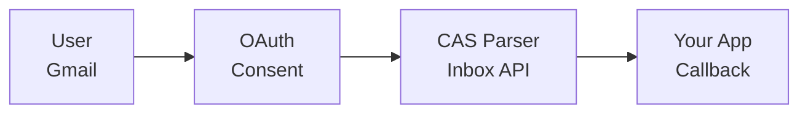

## Overview

Gmail Inbox Import lets users import CAS statements directly from their email — no file uploads or password sharing needed.



**Security features:**
- Read-only access (cannot send emails)
- OAuth-based consent flow
- User can revoke access anytime
- Tokens encrypted server-side

## Integration flow

### Step 1: Initiate OAuth

```python
import requests

response = requests.post(
    "https://api.casparser.in/v4/inbox/connect",
    headers={"x-api-key": "YOUR_API_KEY"},
    json={"redirect_uri": "https://yourapp.com/oauth/callback"}
)

data = response.json()
oauth_url = data["oauth_url"]

# Redirect user to oauth_url
```

### Step 2: User grants consent

The user is redirected to Google's OAuth consent screen. After granting access, they're redirected back to your `redirect_uri` with an `inbox_token`:

```
https://yourapp.com/oauth/callback?inbox_token=eyJhbGciOiJIUzI1NiIs...
```

### Step 3: List CAS files from inbox

```python
inbox_token = request.args.get("inbox_token")

response = requests.post(
    "https://api.casparser.in/v4/inbox/cas",
    headers={
        "x-api-key": "YOUR_API_KEY",
        "x-inbox-token": inbox_token
    }
)

data = response.json()
for cas_file in data["files"]:
    print(f"Found: {cas_file['filename']} ({cas_file['cas_type']})")
    print(f"Download URL: {cas_file['url']}")
    
    # Parse the CAS file
    parse_response = requests.post(
        "https://api.casparser.in/v4/smart/parse",
        headers={"x-api-key": "YOUR_API_KEY"},
        json={
            "pdf_url": cas_file["url"],
            "password": "YOUR_PAN_NUMBER"
        }
    )
    parsed_data = parse_response.json()
    print(f"Portfolio value: ₹{parsed_data['summary']['total_value']:,.2f}")
```

### Step 4: Disconnect (optional)

```python
requests.post(
    "https://api.casparser.in/v4/inbox/disconnect",
    headers={
        "x-api-key": "YOUR_API_KEY",
        "x-inbox-token": inbox_token
    }
)
```

## API endpoints

| Endpoint | Description |
|----------|-------------|
| `POST /v4/inbox/connect` | Get OAuth URL for user consent |
| `POST /v4/inbox/status` | Check if inbox_token is still valid |
| `POST /v4/inbox/cas` | List and optionally parse CAS files |
| `POST /v4/inbox/disconnect` | Revoke access and delete tokens |

## Response format

```json
{
  "status": "success",
  "files": [
    {
      "message_id": "18d4a2b3c4d5e6f7",
      "filename": "cdsl_20250115_a1b2c3d4.pdf",
      "original_filename": "CDSL_CAS_Statement.pdf",
      "message_date": "2025-01-15",
      "cas_type": "cdsl",
      "sender_email": "ecas@cdslstatement.com",
      "size": 245000,
      "url": "https://cdn.casparser.in/email-cas/user123/cdsl_20250115_a1b2c3d4.pdf",
      "expires_in": 86400
    }
  ],
  "count": 1
}
```

<Note>
  Download URLs expire in **24 hours**. The response contains URLs only — parse each file with `/v4/smart/parse`.
</Note>

## Credit usage

| Operation | Credits |
|-----------|---------|
| Connect (OAuth) | Free |
| List files (`/v4/inbox/cas`) | 0.2 per pull (any number of files) |
| Parse file (`/v4/smart/parse`) | 1.0 per file |

## Using with Portfolio Connect SDK

The Portfolio Connect SDK has built-in Gmail import:

```jsx
<PortfolioConnect
  accessToken="at_xxx"
  modes={["upload", "inbox"]}  // Enable Gmail inbox
  onSuccess={(data) => console.log(data)}
/>
```

## Next steps

<CardGroup cols={2}>
  <Card title="CDSL OTP Fetch" icon="shield-check" href="/guides/cdsl-fetch">
    Real-time holdings via OTP
  </Card>
  <Card title="Portfolio Connect SDK" icon="puzzle-piece" href="/sdk/portfolio-connect">
    Drop-in frontend widget
  </Card>
</CardGroup>
