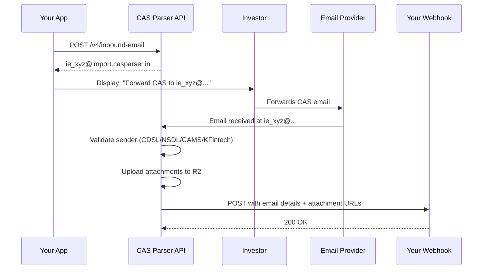

## Overview

The Inbound Email API lets you create unique email addresses (like `ie_xyz@import.casparser.in`) where your users can forward their CAS statements. When an email arrives, we validate the sender, upload attachments to cloud storage, and POST the details to your webhook.

**Use Case**: Lower-friction alternative to OAuth or manual file upload.

---

## How It Works



---

## Quick Start

### 1. Create an Inbound Email

<CodeGroup>

```python Python
import requests

response = requests.post(
    "https://api.casparser.in/v4/inbound-email",
    headers={"x-api-key": "your-api-key"},
    json={
        "callback_url": "https://yourapp.com/webhooks/cas-email",
        "allowed_sources": ["cdsl", "nsdl"],  # Optional filter
        "reference": "user_12345",            # Your internal ID
        "metadata": {"plan": "premium"}       # Optional key-value pairs
    }
)

data = response.json()
print(f"Forward emails to: {data['email']}")
# ie_a1b2c3d4e5f6@import.casparser.in
```

```javascript Node.js
const response = await fetch('https://api.casparser.in/v4/inbound-email', {
  method: 'POST',
  headers: {
    'x-api-key': 'your-api-key',
    'Content-Type': 'application/json',
  },
  body: JSON.stringify({
    callback_url: 'https://yourapp.com/webhooks/cas-email',
    allowed_sources: ['cdsl', 'nsdl'],
    reference: 'user_12345',
    metadata: { plan: 'premium' }
  })
});

const data = await response.json();
console.log(`Forward emails to: ${data.email}`);
// ie_a1b2c3d4e5f6@import.casparser.in
```

```bash cURL
curl -X POST https://api.casparser.in/v4/inbound-email \
  -H "x-api-key: your-api-key" \
  -H "Content-Type: application/json" \
  -d '{
    "callback_url": "https://yourapp.com/webhooks/cas-email",
    "allowed_sources": ["cdsl", "nsdl"],
    "reference": "user_12345",
    "metadata": {"plan": "premium"}
  }'
```

</CodeGroup>

**Response:**
```json
{
  "status": "success",
  "inbound_email_id": "ie_a1b2c3d4e5f6",
  "email": "ie_a1b2c3d4e5f6@import.casparser.in",
  "callback_url": "https://yourapp.com/webhooks/cas-email",
  "allowed_sources": ["cdsl", "nsdl"],
  "reference": "user_12345",
  "metadata": {"plan": "premium"},
  "status": "active",
  "created_at": "2025-02-22T20:00:00Z"
}
```

---

### 2. Display to User

Show the email address in your UI:

```
📧 Forward your CAS statement to:
   ie_a1b2c3d4e5f6@import.casparser.in
```

---

### 3. Handle Webhook

When the user forwards an email, we POST to your `callback_url`:

<CodeGroup>

```python Python (Flask)
from flask import Flask, request, jsonify
import requests

app = Flask(__name__)

@app.route('/webhooks/cas-email', methods=['POST'])
def handle_cas_webhook():
    data = request.get_json()
    
    # Process the inbound email
    print(f"Forwarded by: {data['forwarded_by']}")  # Investor's email
    print(f"User reference: {data['reference']}")
    print(f"Files received: {data['count']}")
    
    # Download files (URLs expire in 48 hours)
    for file in data['files']:
        url = file['url']
        filename = file['filename']
        cas_type = file['cas_type']
        
        # Download to your storage
        response = requests.get(url)
        if response.status_code == 200:
            # Save to disk or upload to your storage
            with open(f"/tmp/{filename}", 'wb') as f:
                f.write(response.content)
            print(f"Downloaded {cas_type}: {filename}")
    
    return jsonify({"status": "success"})
```

```javascript Node.js (Express)
const express = require('express');
const fetch = require('node-fetch');
const fs = require('fs');

const app = express();
app.use(express.json());

app.post('/webhooks/cas-email', async (req, res) => {
  const data = req.body;
  
  console.log(`Forwarded by: ${data.forwarded_by}`);  // Investor's email
  console.log(`User reference: ${data.reference}`);
  console.log(`Files received: ${data.count}`);
  
  // Download files (URLs expire in 48 hours)
  for (const file of data.files) {
    const url = file.url;
    const filename = file.filename;
    const casType = file.cas_type;
    
    // Download to your storage
    const response = await fetch(url);
    if (response.ok) {
      const buffer = await response.buffer();
      // Save to disk or upload to your storage
      fs.writeFileSync(`/tmp/${filename}`, buffer);
      console.log(`Downloaded ${casType}: ${filename}`);
    }
  }
  
  res.json({ status: 'success' });
});
```

</CodeGroup>

**Webhook Payload:**
```json
{
  "inbound_email_id": "ie_a1b2c3d4e5f6",
  "forwarded_by": "investor@gmail.com",
  "reference": "user_12345",
  "metadata": {"plan": "premium"},
  "files": [
    {
      "message_id": "att_xyz789",
      "filename": "cdsl_20250222_att_xyz789.pdf",
      "original_filename": "JAN2026_AA03773313_TXN.pdf",
      "message_date": "2025-02-22",
      "cas_type": "cdsl",
      "sender_email": "ecas@cdslstatement.com",
      "size": 245000,
      "url": "https://storage.casparser.in/inbound-email/...",
      "expires_in": 172800
    }
  ],
  "count": 1
}
```

---

## Sender Validation

We automatically verify that forwarded emails originated from trusted CAS authorities:

- **CDSL** → eCAS@cdslstatement.com
- **NSDL** → NSDL-CAS@nsdl.co.in
- **CAMS** → donotreply@camsonline.com
- **KFintech** → samfS@kfintech.com

**Forwarded emails** are supported — we extract the original sender from email headers and body.

---

## Managing Inbound Emails

### List All

```bash
GET /v4/inbound-email?status=active&limit=50&offset=0
```

### Get Details

```bash
GET /v4/inbound-email/ie_a1b2c3d4e5f6
```

### Delete

```bash
DELETE /v4/inbound-email/ie_a1b2c3d4e5f6
```

---

## Best Practices

### 1. Download Attachments Promptly

Presigned URLs expire in **48 hours**. Download and store attachments in your own storage.

### 2. Use HTTPS for Callbacks

Production callback URLs must use HTTPS (HTTP is allowed for `localhost` during development).

### 3. Use `reference` for Correlation

Store your user ID in `reference` to map inbound emails back to your users.

### 4. Filter by `allowed_sources`

If you only need CDSL statements, set `"allowed_sources": ["cdsl"]` to reject others automatically.

---

## Billing

**0.2 credits** per successfully processed email (validated sender + webhook delivered).

- Emails from unknown senders: **Not billed**
- Failed webhook delivery (after retries): **Still billed** (email was valid)

---

## Error Handling

### Common Issues

| Error | Cause | Solution |
|-------|-------|----------|
| `callback_url must be HTTPS` | Using HTTP in production | Use HTTPS or test with `localhost` |
| `Inbound email not found` | Wrong ID or deleted | Check ID or recreate |
| `alias already taken` | Another inbound email uses this alias | Choose a different alias |

### Webhook Delivery Failures

If your webhook endpoint is down or returns an error, we retry automatically with exponential backoff.

---

## Security

### Email Authentication

We validate:
- **Exact email whitelist**: Only emails from official CAS authority addresses
- **Header parsing**: Extract original sender from forwarded emails

### Webhook Security

- **HTTPS required**: Production callbacks must use HTTPS
- **Automatic retries**: Failed webhook deliveries are retried automatically
- **Attachment URLs**: Time-limited presigned URLs (48h expiry)

### Data Retention

- Inbound email configs: Active indefinitely, marked inactive after 30 days without emails

---

## Use Cases

1. **Onboarding Flow**: "Forward your CAS to get started" — simpler than OAuth
2. **Recurring Updates**: Users forward monthly statements → auto-sync portfolios
3. **Offline Users**: Works for investors without OAuth access or app login

---

## Next Steps

- [Parse CAS PDFs](/guides/parsing) — parse the downloaded files
- [Gmail Inbox Import](/guides/gmail-inbox) — alternative: pull CAS from user's Gmail
- [CDSL Fetch](/guides/cdsl-fetch) — alternative: fetch CAS directly via OTP
