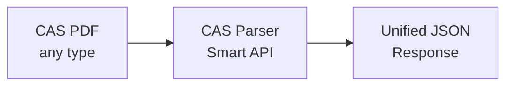

## Overview

CAS Parser extracts structured data from Consolidated Account Statement (CAS) PDFs issued by Indian depositories and registrars.



## Supported CAS types

| Source | Format | Password | Coverage |
|--------|--------|----------|----------|
| **CDSL** | eCAS from www.cdslindia.com/cas/logincas.aspx | PAN number | All holdings (CDSL + NSDL) |
| **NSDL** | eCAS from nsdlcas.nsdl.com/ecas/ecas.php | PAN number | All holdings (NSDL + CDSL) |
| **CAMS** | CAS from camsonline.com | PAN number | Mutual funds only |
| **KFintech** | CAS from kfintech.com | User-defined password | Mutual funds only |

<Tip>
  Use `/v4/smart/parse` — it auto-detects the CAS type and applies the correct parser.
</Tip>

<Note>
  **Cross-depository coverage:** CDSL and NSDL eCAS statements contain holdings from **both** depositories (CDSL + NSDL), not just the issuing depository. This includes demat and non-demat assets across all accounts.
</Note>

## Parse a PDF file

<CodeGroup>
```python Python
import requests

response = requests.post(
    "https://api.casparser.in/v4/smart/parse",
    headers={"x-api-key": "YOUR_API_KEY"},
    files={"file": open("cas.pdf", "rb")},
    data={"password": "ABCDE1234F"}
)

data = response.json()
```

```javascript Node.js
const form = new FormData();
form.append('file', fs.createReadStream('cas.pdf'));
form.append('password', 'ABCDE1234F');

const response = await fetch('https://api.casparser.in/v4/smart/parse', {
  method: 'POST',
  headers: { 'x-api-key': 'YOUR_API_KEY' },
  body: form
});

const data = await response.json();
```

```bash cURL
curl -X POST https://api.casparser.in/v4/smart/parse \
  -H "x-api-key: YOUR_API_KEY" \
  -F "file=@cas.pdf" \
  -F "password=ABCDE1234F"
```
</CodeGroup>

## Parse from URL

If your CAS PDF is hosted online:

```python
response = requests.post(
    "https://api.casparser.in/v4/smart/parse",
    headers={
        "x-api-key": "YOUR_API_KEY",
        "Content-Type": "application/json"
    },
    json={
        "pdf_url": "https://example.com/cas.pdf",
        "password": "ABCDE1234F"
    }
)
```

## Response format

All CAS types return a unified JSON structure:

```json
{
  "meta": {
    "cas_type": "CDSL",
    "statement_period": {
      "from": "2024-01-01",
      "to": "2024-01-31"
    },
    "generated_at": "2024-02-01T10:30:00Z"
  },
  "investor": {
    "name": "John Doe",
    "pan": "ABCDE1234F",
    "email": "john@example.com",
    "mobile": "9876543210",
    "address": "123 Main St, Mumbai",
    "pincode": "400001",
    "cas_id": "CAS123456"
  },
  "summary": {
    "total_value": 2500000.00,
    "accounts": {
      "demat": {
        "count": 2,
        "total_value": 1500000.00
      },
      "mutual_funds": {
        "count": 5,
        "total_value": 900000.00
      },
      "insurance": {
        "count": 1,
        "total_value": 50000.00
      },
      "nps": {
        "count": 1,
        "total_value": 50000.00
      }
    }
  },
  "demat_accounts": [
    {
      "demat_type": "CDSL",
      "dp_id": "12345678",
      "dp_name": "HDFC Bank",
      "client_id": "12345678901234",
      "bo_id": "12345678901234",
      "value": 1500000.00,
      "linked_holders": [...],
      "holdings": {
        "equities": [...],
        "corporate_bonds": [...],
        "government_securities": [...],
        "aifs": [...],
        "demat_mutual_funds": [...]
      },
      "additional_info": {...}
    }
  ],
  "mutual_funds": [
    {
      "folio_number": "1234567890",
      "amc": "HDFC Mutual Fund",
      "registrar": "CAMS",
      "value": 450000.00,
      "linked_holders": [...],
      "schemes": [...],
      "additional_info": {...}
    }
  ],
  "insurance": {
    "life_insurance_policies": [...]
  },
  "nps": [...]
}
```

## Asset classes extracted

CAS Parser extracts **9 asset classes** from your CAS:

| Asset Class | Source | Fields |
|-------------|--------|--------|
| Equities | CDSL, NSDL | ISIN, name, units, value |
| Mutual Funds (Demat) | CDSL, NSDL, CAMS, KFintech | ISIN, scheme, units, NAV |
| Mutual Funds (Non-Demat) | CAMS, KFintech | Folio, scheme, units, NAV, transactions |
| Corporate Bonds | CDSL, NSDL | ISIN, issuer, coupon, maturity |
| G-Secs | CDSL, NSDL | ISIN, name, units, value |
| AIFs | CDSL, NSDL | ISIN, fund, units, value |
| Insurance | CDSL, NSDL | Policy, provider, sum assured |
| NPS | CDSL, NSDL | PRAN, tier, fund, units |
| ETFs | CDSL, NSDL | ISIN, name, units, value |

## Password requirements

| CAS Type | Password Format | Example |
|----------|-----------------|---------|
| CDSL eCAS | PAN number | `ABCDE1234F` |
| NSDL eCAS | PAN number | `ABCDE1234F` |
| CAMS CAS | Plain PAN | `ABCDE1234F` |
| KFintech CAS | User-defined password | `Min 8 chars (1 upper, 1 lower, 1 number, 1 special)` |

<Note>
  For all CAS types except KFintech, the password is the investor's PAN number. If parsing fails, verify the PAN and check that the PDF is an original digitally-generated statement.
</Note>

## Error handling

```python
response = requests.post(...)
data = response.json()

if data.get("status") == "failed":
    error = data.get("msg")
    # Common errors:
    # - "Invalid password" — wrong PAN/encryption
    # - "Invalid PDF" — corrupted or scanned file
    # - "Unsupported format" — not a CAS file
```

## Next steps

<CardGroup cols={2}>
  <Card title="Gmail Import" icon="envelope" href="/guides/gmail-inbox">
    Import CAS from user email
  </Card>
  <Card title="CAS Generator" icon="rotate" href="/guides/cas-generator">
    Request CAS programmatically
  </Card>
</CardGroup>
