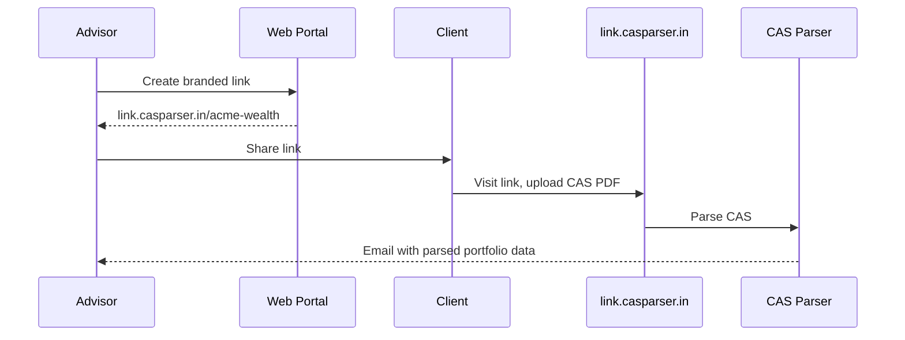

## Overview

Portfolio Links let advisors and wealth managers create branded collection pages where clients can upload their CAS PDFs. The parsed portfolio data is emailed to the advisor automatically.

**Use case:** Collect CAS from clients without building any integration. Share a link, clients upload, you get parsed data.

---

## How It Works

---

## Getting Started

1. Go to [app.casparser.in/portfolio-links](https://app.casparser.in/portfolio-links)
2. Click **Create Link**
3. Enter your company name, slug, and notification email
4. Optionally upload a logo for your branded page
5. Share your link: `link.casparser.in/{your-slug}`

That's it. No API integration needed. Everything is managed through the web portal.

---

## Use Cases

| Use Case | Approach |
|----------|----------|
| **Per advisor/RM** | Each relationship manager creates their own link |
| **Per client segment** | Different links for HNI, retail, corporate clients |
| **Per campaign** | Track submissions by marketing campaign |
| **Per branch/city** | Separate links for different office locations |

---

## Billing

Portfolio Links submissions consume credits at the standard CAS parsing rate (**1.0 credit** per parsed CAS).

---

## Related

<CardGroup cols={2}>
  <Card title="Web Portal" icon="browser" href="https://app.casparser.in/portfolio-links">
    Create and manage your Portfolio Links
  </Card>
  <Card title="Portfolio Connect SDK" icon="code" href="/sdk/portfolio-connect">
    Need a code-based integration? Use the embeddable SDK instead
  </Card>
</CardGroup>
