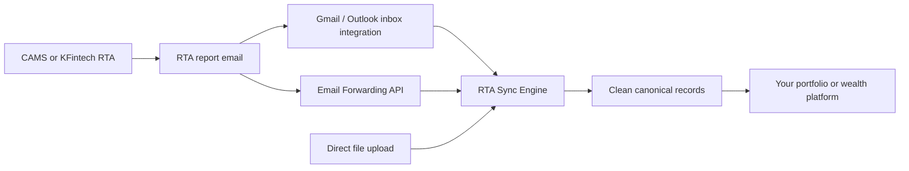

## Overview

> Get RTA files in. Get clean investment records out.

RTA Sync is reverse-feed infrastructure for CAMS and KFintech, India's leading
Registrar and Transfer Agents (RTAs). It receives RTA files, cleans provider-
specific data, and delivers consistent records to MFD and wealth platforms.

The product contract is intentionally simple:

```text
RTA reverse feed -> RTA Sync Engine -> clean canonical records
```

The engine detects the source format, cleans the rows, applies provider-specific
transaction rules, and returns a consistent JSON response for your portfolio or
wealth platform.

In the back-office market, this is commonly called a **reverse feed**: CAMS and
KFintech send updated holdings and transaction data to the platform that serves
the distributor. RTA Sync focuses on the quality of that data transfer and the
records produced from it.

## How the product works

RTA reports are commonly delivered to the distributor's registered email inbox.
RTA Sync can receive those files through either of these delivery paths:



The delivery connectors get the file to the engine. The RTA Sync Engine does
the data work:

1. Detect the RTA and file format.
2. Map provider fields into a common vocabulary.
3. Normalize dates, numbers, signs, and transaction semantics.
4. Handle provider-specific reversal, switch, and transfer markers.
5. Return clean records, warnings, and a batch summary.

Use direct file upload for the simplest integration. Inbox and email forwarding
connectors deliver files to the same engine.

## Is this an RTA file reader?

Yes, but the output is more useful than a file listing. The engine reads the
source file and returns canonical investment records that your application can
use without maintaining separate CAMS and KFintech field mappings.

## Who it is for

RTA Sync is designed for:

- wealth and portfolio platforms;
- mutual-fund distributors and RIAs;
- fintech applications onboarding investor portfolios;
- engineering teams maintaining CAMS/KFintech feed pipelines.

## Two operating models

### Platforms serving multiple distributors

Use RTA Sync as a data layer behind your MFD or wealth platform:

- route each file to the right platform tenant, distributor, or branch;
- remove separate CAMS/KFintech parsing logic from your product;
- expose consistent transactions, AUM, SIP, commission, and exception data;
- keep the distributor-facing product focused on onboarding, portfolio views,
  research, and client servicing.

### Distributor and sub-distributor networks

Use RTA Sync to keep each advisor's book current:

- attribute records to the correct distributor, sub-distributor, broker code, or
  EUIN when the source provides it;
- update client, folio, scheme, AUM, SIP, transaction, and commission views;
- surface rejected, pending, missing, and unmatched records for operations;
- give every advisor clean portfolio data without asking them to manually clean
  RTA files.

Each RTA report family maps to a typed data set. Transaction records are shown
in this guide; the same file-level envelope carries investor, folio, AUM, SIP,
NAV, exception, brokerage, mandate, and settlement-exception objects. Bulk SOA
and PDF statements use the CAS document APIs.

## What RTA Sync powers

RTA Sync is a data layer for the back-office functions that depend on RTA data:

- portfolio tracking and current holdings;
- client reporting and historical transactions;
- commission and brokerage reconciliation;
- CRM updates for investors, folios, SIPs, and KYC status;
- operational queues for rejected, pending, missing, or unmatched records.

RTA Sync does not execute buy, sell, switch, SIP, STP, or SWP orders. It keeps
the data behind those workflows accurate.

## Why reverse-feed quality matters

Small source errors become visible product failures. A missed dividend
reinvestment, incorrectly paired switch, stale AUM snapshot, or unresolved
brokerage payout can make a distributor distrust the entire back office.

RTA Sync preserves source fields, emits warnings, and separates transactions,
snapshots, systematic instructions, brokerage payouts, and exceptions instead
of forcing every report into one row shape.

## RTA report families

RTA Sync supports more than transaction files. Each report family maps to the
data objects and workflows it contains:

| Report family | Representative reports | RTA Sync data object | Primary use |
|---|---|---|---|
| Investor and folio master | KFintech MFSD211, MFSD311 | `investor`, `folio` | Client and account servicing. |
| Transactions | MFSD201, MFSD221, MFSD223, MFSD307; CAMS WBR2 family | `transaction` | Portfolio activity and history. |
| AUM and holdings | MFSD202, MFSD203, MFSD219, MFSD310 | `position_snapshot` | AUM, holdings, and portfolio views. |
| SIP/STP/SWP lifecycle | MFSD227-MFSD231, MFSD243, MFSD244, MFSD313, MFSD314, MFSD327, MFSD331 | `systematic_instruction` | Registrations, pauses, expiries, terminations, and rejections. |
| NAV reference | MFSD301, MFSD308, MFSD217 | `nav` | Scheme valuation and historical NAV. |
| Dividend and bonus | MFSD309, MFSD213 | `corporate_action` | Distribution and corporate-action history. |
| Rejections and pending work | MFSD218, MFSD236, MFSD241, MFSD315, MFSD316 | `exception` | Operations and remediation queues. |
| KYC and data quality | MFSD232, MFSD239, MFSD240, MFSD247, MFSD258, MFSD262, MFSD263, MFSD339 | `exception`, `investor` | Missing, invalid, or compliance data. |
| Brokerage and payouts | MFSD205-MFSD208, MFSD222, MFSD238, MFSD245, MFSD249, MFSD250, MFSD260; CAMS WBR77 | `brokerage_payout` | Commission, TDS, payout, cheque, and warrant workflows. |
| Mandates and settlement | MFSD347A, MFSD348 | `mandate`, `settlement_exception` | Bank mandate and undelivered payment tracking. |
| Non-commercial and transfer activity | MFSD237, MFSD252, MFSD352 | `transaction`, `exception` | TI/TO and non-commercial activity. |
| Analytics and market reports | MFSD209, MFSD212, MFSD214, MFSD215, MFSD225, MFSD302, MFSD303 | `analytics_report` | Rankings, market size, procurement, and management views. |
| Statement documents | MFSD248 and CAS documents | CAS document APIs | Bulk SOA and PDF statements are routed through document parsing rather than structured feed normalization. |

The report code identifies the provider file. It does not define the data
object by itself. A report such as MFSD221 can produce both investor-master and
transaction data sets. CAMS WBR2 reports map to transactions, while WBR77
reports map to brokerage payouts.

## Normalize one or more files

### Request

`POST /v1/rta-sync/normalize`

The request uses `multipart/form-data`:

| Field | Required | Description |
|---|---|---|
| `files` | Yes | One or more related CAMS or KFintech feed files. Send one item for a single-file request. |
| `reference` | Yes | Your opaque tenant, distributor, sub-distributor, or batch reference, echoed in the response. |
| `report_code` | No | Report identifier when all submitted files are the same report type. |
| `provider` | No | `auto`, `cams`, or `kfintech`. Defaults to `auto`. |
| `include_source` | No | Include all original source fields in record provenance. Defaults to `false`. |

Supported file formats:

- CSV
- XLS
- XLSX
- DBF

### cURL

```bash cURL
curl --fail-with-body \
  -X POST https://api.casparser.in/v1/rta-sync/normalize \
  -H "x-api-key: $CASPARSER_API_KEY" \
  -F "files=@kfintech-feed.csv" \
  -F "reference=jan-2026-mfd-001" \
  -F "report_code=MFSD221" \
  -F "provider=auto" \
  -F "include_source=true"
```

### Python

```python Python
import os
import requests

with open("kfintech-feed.csv", "rb") as feed_file:
    response = requests.post(
        "https://api.casparser.in/v1/rta-sync/normalize",
        headers={"x-api-key": os.environ["CASPARSER_API_KEY"]},
        files=[("files", ("kfintech-feed.csv", feed_file, "text/csv"))],
        data={
            "reference": "jan-2026-mfd-001",
            "report_code": "MFSD221",
            "provider": "auto",
            "include_source": "true",
        },
        timeout=60,
    )

response.raise_for_status()
result = response.json()
for file_result in result["data"]["files"]:
    for data_set in file_result["data_sets"]:
        for record in data_set["records"]:
            print(data_set["object_type"], record["record_key"])
```

### Node.js

```javascript Node.js
import fs from "node:fs";

const form = new FormData();
form.append(
  "files",
  new Blob([fs.readFileSync("kfintech-feed.csv")], { type: "text/csv" }),
  "kfintech-feed.csv",
);
form.append("reference", "jan-2026-mfd-001");
form.append("report_code", "MFSD221");
form.append("provider", "auto");
form.append("include_source", "true");

const response = await fetch("https://api.casparser.in/v1/rta-sync/normalize", {
  method: "POST",
  headers: { "x-api-key": process.env.CASPARSER_API_KEY },
  body: form,
});

if (!response.ok) {
  throw new Error(`RTA Sync failed: ${response.status}`);
}

const result = await response.json();
console.log(result.data.files);
```

## Response

The response is a batch envelope. Even a one-file request returns a `files`
array so the same contract works for multiple attachments.

```json
{
  "status": "success",
  "data": {
    "schema_version": "rta-sync.v1",
    "key_version": "rta-key.v1",
    "batch_key": "sha256:0123456789abcdef0123456789abcdef0123456789abcdef0123456789abcdef",
    "reference": "jan-2026-mfd-001",
    "files": [
      {
        "file_index": 0,
        "filename": "kfintech-feed.csv",
        "provider": "kfintech",
        "report_code": "MFSD221",
        "report_family": "transaction_investor_master",
        "detection_confidence": "strong",
        "source_sha256": "0123456789abcdef0123456789abcdef0123456789abcdef0123456789abcdef",
        "mapping_version": "rta-sync-2026-08",
        "source_schema": "kfintech_format1",
        "data_sets": [
          {
            "object_type": "transaction",
            "record_count": 1,
            "records": [
              {
                "record_type": "transaction",
                "record_key": "kfintech:1227:0:91046479506:2026-01-15",
                "source_record_key": "BSE000123",
                "folio_number": "91046479506",
                "product_code": "HDFC",
                "scheme_code": "HDFC0001",
                "transaction_id": "BSE000123",
                "transaction_number": "1227",
                "parent_transaction_number": null,
                "transaction_date": "2026-01-15",
                "nav_date": "2026-01-15",
                "processing_date": "2026-01-16",
                "nav": "100.25",
                "units": "10.000000",
                "amount": "1002.50",
                "currency": "INR",
                "transaction_type": "P",
                "action": "buy",
                "action_tag": "purchase",
                "effect": "increase_units",
                "cash_effect": "cash_outflow",
                "transaction_mode": "N",
                "transaction_status": "successful",
                "is_reversal": false,
                "reversal_resolution": null,
                "pan": "ABCDE1234F",
                "investor_name": "Example Investor",
                "broker_code": "ARN-12345",
                "sub_broker_code": null,
                "euin": null,
                "identity_quality": "strong",
                "relations": [],
                "provenance": {
                  "source_rows": [
                    {"row_number": 2, "sheet": null, "source_row_key": "1227"}
                  ],
                  "source_fields": {
                    "TD_PURRED": "P",
                    "TRFLAG": ""
                  }
                },
                "warnings": []
              }
            ],
            "warnings": []
          }
        ],
        "rejected_rows": [],
        "summary": {
          "source_rows": 1,
          "output_records": 1,
          "rejected_rows": 0,
          "warning_count": 0
        },
        "warnings": []
      }
    ],
    "summary": {
      "input_files": 1,
      "source_rows": 1,
      "output_records": 1,
      "rejected_rows": 0,
      "warning_count": 0
    },
    "warnings": []
  }
}
```

## Canonical record fields

Each file result identifies what was received and how it was mapped:

| Field | Description |
|---|---|
| `file_index` | Zero-based upload position. Results preserve request order. |
| `provider` | Detected RTA: `cams` or `kfintech`. |
| `report_code` | Provider report identifier such as `MFSD221` or `WBR2`. |
| `report_family` | Normalized report family. |
| `detection_confidence` | `strong` or `weak`; ambiguous detection fails the batch. |
| `source_sha256` | SHA-256 hash of the source file. |
| `mapping_version` | Version of the mapping rules used for the file. |
| `source_schema` | Detected provider schema. |
| `data_sets` | Typed records emitted from the file. |

Every canonical record has shared identity and provenance fields:

| Field | Description |
|---|---|
| `record_type` | Canonical object type, such as `transaction` or `position_snapshot`. |
| `record_key` | Object-specific canonical identity. Investor, folio, and scheme keys are report-family independent; event keys use provider source identity. |
| `source_record_key` | Provider-native row or event identity when available. |
| `identity_quality` | `strong`, `weak`, or `ambiguous` source identity. |
| `relations` | Explicit reversal, supersession, switch, transfer, or lineage links. |
| `provenance.source_rows` | Every source row used to produce the canonical record. |
| `provenance.source_fields` | Original source fields when `include_source=true`. |
| `warnings` | Row-level mapping or data-quality warnings. |

Transaction records add these fields:

| Field | Description |
|---|---|
| `folio_number` | Mutual-fund folio or account number. |
| `product_code` | Provider product or AMC code when available. |
| `scheme_code` | Provider scheme or plan code. |
| `transaction_id` | Provider transaction or order ID when available. |
| `transaction_number` | Provider transaction or line number. |
| `parent_transaction_number` | Parent transaction reference, typically used for reversals. |
| `transaction_date` | Normalized transaction date in `YYYY-MM-DD` format. |
| `nav_date` | NAV date when supplied separately from the transaction date. |
| `processing_date` | RTA processing date when supplied. |
| `nav` | Decimal NAV returned as a string to preserve precision. |
| `units` | Decimal unit quantity returned as a string to preserve precision. |
| `amount` | Decimal transaction amount returned as a string to preserve precision. |
| `transaction_type` | Original provider transaction type. |
| `action` | Canonical action: `buy`, `sell`, or `no_effect`. |
| `action_tag` | Canonical detail such as `purchase`, `redemption`, `switch_in`, or `reversal`. |
| `effect` | Ledger effect after reversal handling: `increase_units`, `decrease_units`, or `no_effect`. |
| `cash_effect` | Cash direction after reversal handling: inflow, outflow, no effect, or unknown. |
| `currency` | Currency for financial amounts. RTA mutual-fund records use `INR`. |
| `transaction_status` | `successful`, `reversed`, `pending`, `failed`, or `unknown`. |
| `transaction_mode` | Original provider transaction mode. |
| `is_reversal` | Whether the source row is a reversal. |
| `reversal_resolution` | `resolved`, `unresolved`, or `null` for non-reversal records. |
| `pan` | PAN when supplied by the source. |
| `investor_name` | Investor name when supplied by the source. |
| `broker_code` | Broker or sub-broker code when supplied by the source. |
| `sub_broker_code` | Sub-distributor code when supplied by the source. |
| `euin` | Employee Unique Identification Number when supplied by the source. |

Fields that are not available in the source are returned as `null`. The engine
does not infer transaction identity from a display name or silently convert a
brokerage amount into an investment transaction amount.

## Financial value semantics

- NAV, units, amounts, AUM, commissions, and TDS are decimal strings.
- Canonical decimal values are non-negative. `action` and `effect` represent
  unit direction; `cash_effect` represents money direction instead of relying
  on a negative sign.
- `currency` is explicit on financial records and is `INR` for the supported
  mutual-fund reverse feeds.
- `transaction_date` is the business transaction date. NAV, processing, payout,
  and snapshot dates use separate fields when present.
- Rounding is not applied during normalization; source precision is preserved.
- Pending, failed, and unknown transactions have no unit effect. Pending and
  failed transactions have no cash effect.

## Identity and provenance

- `schema_version` versions the response contract.
- `key_version` versions the deterministic record-key algorithm.
- `batch_key` is lowercase SHA-256 over the UTF-8 string
  `schema_version + "\n" + key_version + "\n" + pairs`, where `pairs` is the
  newline-joined, lexicographically sorted list of
  `source_sha256:mapping_version` values. File order does not change it;
  duplicate pairs are preserved.
- `record_key` remains stable when the same source identity is reprocessed.
- `identity_quality` tells you whether the key is strong, weak, or ambiguous.
- `provenance.source_rows` lists every row used to create a record, including
  records aggregated from multiple switch or transfer rows.

## Data object categories

RTA Sync uses typed data objects so report-specific fields do not get forced
into a transaction row:

- investor and folio masters;
- AUM and holdings snapshots;
- SIP, STP, and SWP instructions;
- NAV and dividend/bonus reference data;
- rejection, KYC, and other operational exceptions;
- brokerage payouts, mandates, and settlement exceptions.

PDF statements and bulk SOAs use the CAS document APIs rather than the
structured reverse-feed normalization contract.

Do not map those rows into the transaction object.

## Batch behavior

Send one file when you have one report. Send multiple files when an email or
reporting period gives you related attachments:

- every input file gets its own result, source schema, typed data sets, summary,
  and warnings;
- file results preserve upload order and include `file_index`, so duplicate
  filenames remain distinguishable;
- `reference` is echoed for your correlation and is not used as server-side
  state;
- RTA Sync does not merge files or compare them with earlier batches;
- use the reconciliation operation for cross-file comparison and change detection.
- A file-level failure fails the entire request; row-level warnings do not.

For a file-level failure, the API returns `400` with an `errors[]` entry for the
affected file and no successful file results.

## Provider-specific cleanup

The canonical output hides source-specific rules while preserving the original
values:

- KFintech transfer and switch flags take precedence over the purchase or
  redemption purpose field.
- Reversal rows retain the business action, set `is_reversal`, expose the final
  ledger `effect`, and link to the original record through `relations` when the
  parent can be resolved.
- An unresolved reversal remains in the output with
  `reversal_resolution: "unresolved"` and an `UNMATCHED_REVERSAL` warning.
- CAMS and KFintech switch and transfer rows may require different aggregation
  rules before output.
- Unknown source columns are available through `provenance.source_fields` when requested.

## Warnings and skipped rows

The API returns warnings instead of silently discarding information whenever it
can continue safely.

Example warning:

```json
{
  "row_number": 42,
  "code": "MISSING_TRANSACTION_ID",
  "message": "The source row has no provider transaction ID; record identity may be weak.",
  "fields": ["transaction_id"]
}
```

Rows are rejected when they cannot be normalized safely. Every rejected source
row appears once in the file-level `rejected_rows`; its length equals
`summary.rejected_rows`. Review
rejected rows and warnings before writing records into a production ledger.

## Reconciliation

RTA Sync reconciliation compares a current normalized batch with a previous
batch supplied by your platform and classifies new, unchanged, changed,
duplicate, reversed, removed, and unmatched records.

`POST /v1/rta-sync/reconcile`

```json
{
  "reference": "distributor_123",
  "current": {
    "schema_version": "rta-sync.v1",
    "key_version": "rta-key.v1",
    "batch_key": "sha256:1111111111111111111111111111111111111111111111111111111111111111",
    "reference": "jan-2026-mfd-001",
    "files": [
      {
        "file_index": 0,
        "filename": "aum-2026-01.csv",
        "provider": "kfintech",
        "report_code": "MFSD310",
        "report_family": "aum",
        "detection_confidence": "strong",
        "source_sha256": "1111111111111111111111111111111111111111111111111111111111111111",
        "mapping_version": "rta-sync-2026-08",
        "source_schema": "kfintech_aum",
        "data_sets": [
          {
            "object_type": "position_snapshot",
            "record_count": 1,
            "records": [
              {
                "record_type": "position_snapshot",
                "record_key": "position:folio-1:scheme-1",
                "identity_quality": "strong",
                "provenance": {"source_rows": [{"row_number": 2}]},
                "relations": [],
                "warnings": [],
                "as_of_date": "2026-01-31",
                "folio_number": "folio-1",
                "scheme_code": "scheme-1",
                "units": "100.000000",
                "nav": "20.00",
                "market_value": "2000.00",
                "currency": "INR"
              }
            ],
            "warnings": []
          }
        ],
        "rejected_rows": [],
        "summary": {"source_rows": 1, "output_records": 1, "rejected_rows": 0, "warning_count": 0},
        "warnings": []
      }
    ],
    "summary": {"input_files": 1, "source_rows": 1, "output_records": 1, "rejected_rows": 0, "warning_count": 0},
    "warnings": []
  },
  "previous": {
    "schema_version": "rta-sync.v1",
    "key_version": "rta-key.v1",
    "batch_key": "sha256:2222222222222222222222222222222222222222222222222222222222222222",
    "reference": "dec-2025-mfd-001",
    "files": [
      {
        "file_index": 0,
        "filename": "aum-2025-12.csv",
        "provider": "kfintech",
        "report_code": "MFSD310",
        "report_family": "aum",
        "detection_confidence": "strong",
        "source_sha256": "2222222222222222222222222222222222222222222222222222222222222222",
        "mapping_version": "rta-sync-2026-08",
        "source_schema": "kfintech_aum",
        "data_sets": [
          {
            "object_type": "position_snapshot",
            "record_count": 1,
            "records": [
              {
                "record_type": "position_snapshot",
                "record_key": "position:folio-1:scheme-1",
                "identity_quality": "strong",
                "provenance": {"source_rows": [{"row_number": 2}]},
                "relations": [],
                "warnings": [],
                "as_of_date": "2025-12-31",
                "folio_number": "folio-1",
                "scheme_code": "scheme-1",
                "units": "100.000000",
                "nav": "19.00",
                "market_value": "1900.00",
                "currency": "INR"
              }
            ],
            "warnings": []
          }
        ],
        "rejected_rows": [],
        "summary": {"source_rows": 1, "output_records": 1, "rejected_rows": 0, "warning_count": 0},
        "warnings": []
      }
    ],
    "summary": {"input_files": 1, "source_rows": 1, "output_records": 1, "rejected_rows": 0, "warning_count": 0},
    "warnings": []
  },
  "scope": {
    "mode": "snapshot",
    "providers": ["cams", "kfintech"],
    "report_families": ["aum", "transaction"],
    "current": {"complete": true, "as_of_date": "2026-01-31"},
    "previous": {"complete": true, "as_of_date": "2025-12-31"}
  },
  "mapping_policy": "require_same",
  "object_types": ["transaction", "position_snapshot"]
}
```

The response returns per-record classifications and field-level changes:

```json
{
  "status": "success",
  "data": {
    "reference": "distributor_123",
    "scope": {
      "mode": "snapshot",
      "providers": ["cams", "kfintech"],
      "report_families": ["aum", "transaction"],
      "current": {"complete": true, "as_of_date": "2026-01-31"},
      "previous": {"complete": true, "as_of_date": "2025-12-31"}
    },
    "mapping_policy": "require_same",
    "summary": {
      "total": 1000,
      "new_count": 20,
      "unchanged_count": 950,
      "changed_count": 10,
      "duplicate_count": 5,
      "reversed_count": 3,
      "removed_count": 2,
      "unmatched_count": 10
    },
    "results": [
      {
        "object_type": "transaction",
        "classification": "changed",
        "current_record_key": "transaction-123",
        "previous_record_key": "transaction-123",
        "changes": [
          {"field": "/amount", "before": "1000.00", "after": "1002.50"}
        ]
      }
    ]
  }
}
```

Reconciliation is stateless: both comparison sides are supplied in the
request. The API does not retain a prior batch or decide which platform record
should win.

Use `event_stream` scope for observed transaction/activity files; absence from a
later event feed is not a removal. Use `snapshot` with `complete: true` only when
both sides contain the full declared scope. The `removed` classification is
emitted only for that complete-snapshot case. Mapping, key, and schema versions
must match unless `mapping_policy` is `allow_compatible`.

## Errors

| Status | Meaning |
|---|---|
| `400` | A file is invalid, unsupported, empty, or does not match the selected provider. The entire batch fails. |
| `401` | API key is missing or invalid. |
| `403` | API quota or account permissions do not allow the operation. |
| `500` | The RTA Sync Engine failed. Retry with backoff. |

Use the `X-Request-ID` response header when contacting support.

## Common feed issues

RTA files can fail for different reasons. The API reports file-level and
row-level warnings so you can distinguish format problems from data problems.

- Header, delimiter, encoding, or spreadsheet layout differs.
- The same attachment is delivered more than once.
- A report contains multiple attachments or mixed report types.
- A reversal has no parent reference or uses a changed transaction number.
- Switch and transfer rows are split across multiple source rows.
- A scheme code, folio, PAN, or transaction ID is missing or ambiguous.
- AUM or closing assets are mistaken for transaction amounts.
- SIP, STP, rejection, KYC, or brokerage rows are not transaction records.
- Broker, sub-broker, EUIN, and investor attribution are mixed together.

Use the warning `code` and `fields` to decide whether to accept the record,
retry the file, or send it to your review workflow.

## Scope

The file API processes one or more RTA feed files per request. It returns clean
records and typed data sets without calculating positions or brokerage payouts
inside the normalization step.

For inbox delivery, see [Email Inbox Import](/guides/gmail-inbox) and [Inbound
Email API](/guides/inbound-email). Those connectors deliver files; RTA Sync
cleans them.
