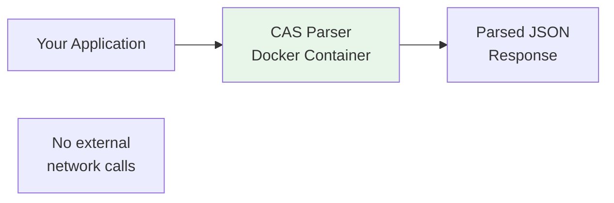

## Overview

On-premise deployment allows you to run CAS Parser on your own infrastructure — all parsing happens locally within your network. No data leaves your servers.

**Use cases:**
- Banks and financial institutions with strict data policies
- Compliance requirements for on-shore data processing
- High-volume parsing (eliminate API rate limits)
- Air-gapped environments

<Note>
  On-premise deployment is **available for enterprise customers only**. Contact [sales](https://casparser.in/contact) to discuss licensing.
</Note>

## Architecture



**What you get:**
- Docker image with CAS Parser runtime
- License key for activation
- Local parsing (no external API calls)
- All features: CDSL, NSDL, CAMS, KFintech

**What you don't get:**
- CDSL OTP Fetch (requires CDSL portal access)
- Gmail Inbox Import (requires OAuth with our credentials)
- KFintech CAS Generator (requires KFintech portal access)

## Deployment

### 1. Receive Docker Image

We'll provide a private Docker image URL and credentials:

```bash
docker login registry.casparser.in
docker pull registry.casparser.in/casparser:enterprise
```

### 2. Run Container

```bash
docker run -d \
  -p 8080:8080 \
  -e LICENSE_KEY="your-license-key" \
  -e MAX_WORKERS=4 \
  --name casparser \
  registry.casparser.in/casparser:enterprise
```

### 3. Parse CAS PDFs

```python
import requests

response = requests.post(
    "http://localhost:8080/v4/smart/parse",
    files={"file": open("cas.pdf", "rb")},
    data={"password": "ABCDE1234F"}
)

data = response.json()
print(data['investor']['name'])
```

## Configuration

| Environment Variable | Description | Default |
|---------------------|-------------|---------|
| `LICENSE_KEY` | Your enterprise license key (required) | - |
| `MAX_WORKERS` | Gunicorn worker processes | 4 |
| `WORKER_TIMEOUT` | Request timeout in seconds | 120 |
| `LOG_LEVEL` | Logging verbosity | `INFO` |

## License Validation

The container validates your license key on startup:

- **Valid license** → Container starts, parsing enabled
- **Invalid/expired license** → Container exits with error
- **Network check** → License verified once at startup (one-time call to `license.casparser.in`)

After initial validation, the container runs fully offline. No subsequent external calls are made.

## Supported Features

| Feature | On-Premise | Cloud API |
|---------|------------|-----------|
| CDSL CAS parsing | ✅ | ✅ |
| NSDL CAS parsing | ✅ | ✅ |
| CAMS CAS parsing | ✅ | ✅ |
| KFintech CAS parsing | ✅ | ✅ |
| Contract Notes | ✅ | ✅ |
| CDSL OTP Fetch | ❌ | ✅ |
| Gmail Inbox Import | ❌ | ✅ |
| KFintech Generator | ❌ | ✅ |

## Scaling

**Horizontal scaling:**

```yaml
# docker-compose.yml
version: '3.8'
services:
  casparser:
    image: registry.casparser.in/casparser:enterprise
    environment:
      LICENSE_KEY: your-license-key
    deploy:
      replicas: 3
    ports:
      - "8080-8082:8080"
```

**Load balancing:**

Use Nginx to distribute traffic across multiple containers.

## Updates

We release quarterly updates with bug fixes and new features:

- **Automatic updates:** Not available (air-gapped)
- **Manual updates:** Pull new image version, restart container
- **Version pinning:** Recommended for production (`casparser:enterprise-v2.1.0`)

Contact support for update notifications.

## Monitoring

The container exposes health endpoints:

```bash
# Health check
curl http://localhost:8080/health
# {"status": "ok", "version": "2.1.0"}

# License status
curl http://localhost:8080/license
# {"valid": true, "expires": "2026-12-31"}
```

Integrate with your existing monitoring (Prometheus, Datadog, etc.).

## Pricing

On-premise licenses are based on:

- **Concurrent workers** (not request volume)
- **Annual licensing** (no per-parse fees)
- **Support SLA** 

Includes unlimited parsing within worker limits.

## Getting Started

<Steps>
  <Step title="Contact Sales">
    Email [casparser.in/contact](https://casparser.in/contact) with your requirements (workers, deployment environment, SLA needs)
  </Step>
  <Step title="Receive License">
    We'll provision a license key and share Docker registry credentials
  </Step>
  <Step title="Deploy & Test">
    Pull image, run container, validate parsing with your CAS samples
  </Step>
  <Step title="Go Live">
    Deploy to production with our support team standing by
  </Step>
</Steps>

## Support

Enterprise license includes:

- **Email support** (SLA-based response times)
- **Slack/Teams channel** (for critical issues)
- **Quarterly health checks** (our team reviews your setup)
- **Version upgrade assistance** (guided migration)

## FAQ

<Accordion title="Can I use this in air-gapped environments?">
Yes. After initial license validation, the container runs fully offline. Copy the Docker image to your air-gapped network via USB/DVD.
</Accordion>

<Accordion title="What if my license expires?">
The container will stop accepting new parsing requests. Existing deployments continue running, but you'll need to renew to process new PDFs.
</Accordion>

<Accordion title="Can I modify the Docker image?">
No. The image is proprietary and license-protected. Modifications will invalidate your license.
</Accordion>

<Accordion title="Is source code available?">
On-premise deployment uses the same battle-tested code as our cloud API. Source code access is not included, but we can discuss custom development for strategic partners.
</Accordion>

## Get Started

<CardGroup cols={2}>
  <Card title="Speak to an Engineer" icon="comments" href="https://calendly.com/sameer_kumar/cas-parser-1-1-with-sameer">
    Walk through deployment, licensing, and architecture
  </Card>
  <Card title="Email Us" icon="envelope" href="https://casparser.in/contact">
    Send us your requirements and we'll follow up
  </Card>
</CardGroup>
