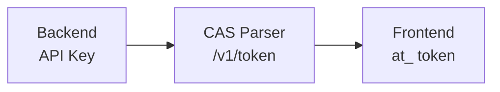

## API Keys

All CAS Parser API requests require authentication via the `x-api-key` header.

### Getting Your API Key

#### From the dashboard

1. Sign up at [app.casparser.in](https://app.casparser.in)
2. Navigate to **Developers** → **API Keys**
3. Click **Generate API Key**
4. Copy and store securely

#### From a coding agent (automated)

If you're using a coding agent (Claude Code, Cursor, etc.), it can obtain an API key
for you automatically. The agent generates a one-time URL, you open it in your browser
and approve, and the agent receives the key — no copy-paste needed.

```bash
# 1. Agent generates a random token
TOKEN=$(openssl rand -hex 32)

# 2. You open this URL and sign in
# https://app.casparser.in/agent-auth?token=${TOKEN}&client_name=YOUR_AGENT_NAME

# 3. Agent polls until you approve
curl -s https://api.casparser.in/v1/agent-auth/token/${TOKEN}
# → {"status": "approved", "api_key": "sk_...", "email": "..."}
```

See the [API reference](/api-reference/introduction) for full details on the agent auth endpoints.

<Warning>
  **Never expose your API key in client-side code.** Use access tokens for frontend applications.
</Warning>

### Using API Keys

<CodeGroup>
```python Python
import requests

response = requests.post(
    "https://api.casparser.in/v4/smart/parse",
    headers={"x-api-key": "YOUR_API_KEY"},
    files={"file": open("cas.pdf", "rb")},
    data={"password": "ABCDE1234F"}
)
```

```javascript Node.js
const response = await fetch('https://api.casparser.in/v4/smart/parse', {
  method: 'POST',
  headers: { 'x-api-key': 'YOUR_API_KEY' },
  body: formData
});
```

```bash cURL
curl -X POST https://api.casparser.in/v4/smart/parse \
  -H "x-api-key: YOUR_API_KEY" \
  -F "file=@cas.pdf" \
  -F "password=ABCDE1234F"
```
</CodeGroup>

## Access Tokens

For frontend/SDK applications, use short-lived access tokens instead of exposing your API key.

### Token Flow



### Generate Access Token

**Backend (server-side):**

```python
import requests

response = requests.post(
    "https://api.casparser.in/v1/token",
    headers={"x-api-key": "YOUR_API_KEY"},
    json={"expiry_minutes": 30}
)

access_token = response.json()["access_token"]
# Returns: at_xxxxxxxxxxxxxxxxxx
```

**Frontend (client-side):**

```javascript
// Get token from your backend
const { access_token } = await fetch('/api/casparser/token').then(r => r.json());

// Use token in place of API key
const response = await fetch('https://api.casparser.in/v4/smart/parse', {
  method: 'POST',
  headers: { 'x-api-key': access_token },  // Use token here
  body: formData
});
```

### Token Properties

| Property | Value |
|----------|-------|
| **Prefix** | `at_` |
| **Max TTL** | 60 minutes |
| **Scope** | All `/v4/*` endpoints |
| **Restrictions** | Cannot generate other tokens, cannot access billing |

### Verify Token

```python
response = requests.post(
    "https://api.casparser.in/v1/token/verify",
    headers={"x-api-key": "YOUR_API_KEY"},
    json={"access_token": "at_xxx"}
)

data = response.json()
# {"valid": true, "expires_at": "2024-01-15T11:30:00Z"}
```

## Security Best Practices

### 1. Environment Variables

**Never hardcode API keys:**

```python
# ❌ Bad
API_KEY = "sk_live_abc123"

# ✅ Good
import os
API_KEY = os.environ.get("CASPARSER_API_KEY")
```

### 2. Backend Token Generation

**Create a backend endpoint:**

```python
# Flask example
from flask import Flask, jsonify
import requests
import os

app = Flask(__name__)

@app.route('/api/casparser/token')
def get_token():
    response = requests.post(
        'https://api.casparser.in/v1/token',
        headers={'x-api-key': os.environ['CASPARSER_API_KEY']},
        json={'expiry_minutes': 30}
    )
    return jsonify(response.json())
```

### 3. Rate Limiting

Implement rate limiting on your backend:

```python
from flask_limiter import Limiter

limiter = Limiter(app, default_limits=["60 per minute"])

@app.route('/api/parse')
@limiter.limit("10 per minute")
def parse_cas():
    # Your parsing logic
    pass
```

### 4. HTTPS Only

Always use HTTPS for API requests. The API will reject HTTP requests.

### 5. Key Rotation

Rotate API keys periodically:

1. Generate new API key in dashboard
2. Update environment variables
3. Deploy updated code
4. Delete old API key

## Sandbox Key

For testing and development:

```
sandbox-with-json-responses
```

- Returns sample data
- No credit consumption
- Rate limited to 10 requests/minute

## Troubleshooting

| Error | Cause | Solution |
|-------|-------|----------|
| `401 Unauthorized` | Invalid API key | Check key in dashboard |
| `401 Unauthorized` | Missing header | Add `x-api-key` header |
| `403 Forbidden` | Expired token | Generate new access token |
| `403 Forbidden` | Quota exceeded | Check credits with `/v1/credits` |

## Next Steps

<CardGroup cols={2}>
  <Card title="Quickstart" icon="rocket" href="/quickstart/python">
    Make your first API call
  </Card>
  <Card title="Error Handling" icon="triangle-exclamation" href="/learn/error-handling">
    Handle authentication errors
  </Card>
</CardGroup>
